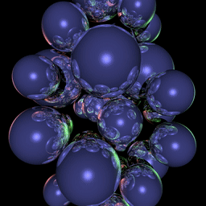
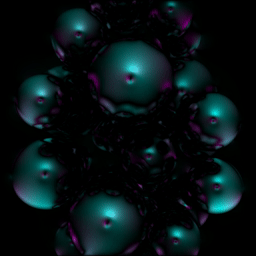
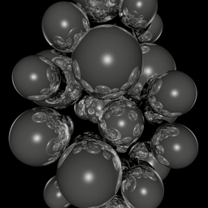

# Ray-Tracing + Optical Flow

MPI-parallel coupled application synthesising images using ray-tracing and calculating optical flow fields for them.



Ray-tracing with color channels (left), optical flow field (middle) and monochromatic ray-tracing (right).

Each mpi Rank performs a user-specified number of repetitions in which a user-specified number of images and their flow fields are computed.
MPI communication takes place when images are sent from a given rank to its *left* neighbor.

## Compilation

Compile with provided Makefile in `src`. Requires suitable `mpicxx` wrapper.

## Execution

Execute one of the binaries in `build`. Takes the following parameters:

* number of mg levels (default 10)
    * this determines the optical flow field size `nxOF = nyOF = 2**maxLevel`
* supersample factor (default 2)
    * this determines the ray tracing image size `nxRT = nyRT = supersampling * nxOF`
* number of multigrid iterations (default 10)
    * the number of multigrid iterations to solve the optical flow problem is fixed (= not dependent on residual norms)
* time step size (default 0.01)
    * this determines the difference between subsequently generated images
* number of time steps (default 4)
    * this determines the number of time steps *for each* MPI rank and *for each* repetition
    * the total number of time steps is `numTimeSteps * mpiNumRanks * numReps`
* number of repetitions (default 1)
* print images (default 0)
    * determines if the synthesised images and their visualized flow fields are to be written to file
    * recommended as off for benchmark runs

Additionally, the number of mpi ranks can be specified when calling `mpirun` / `srun`.

### Makefile Target

Alternatively, the provided Makefile target `bench` can be used to build and execute the application,
as well as converting the written images to png and generating a video from them (if image printing is enabled).

## Example Usage

### Basic Timing on Fritz

```bash
# load required modules
module load git
module load openmpi/4.1.2-gcc11.2.0
module load likwid

# clone the git
git clone https://gitlab.rrze.fau.de/sisekuck/ray-tracing-optical-flow.git

# navigate to source folder
cd ray-tracing-optical-flow/src

# compile serial and OpenMP versions
make

# switch to compute node in interactive job
salloc --partition singlenode --nodes=1 --time 01:00:00

# execute application with either ...
make bench
# ... or with specific parameters
srun -n 72 ../build/ray-tracing-optical-flow-base 12 2 10 0.005 4 12 0

# revoke node allocation
exit
```

### Performance Measurement on Fritz with LIKWID

For added performance measurements, the same steps as above need to be done except allocating the job and executing the binary.
This is replaced with

```bash
#allocate the job with `hwperf` constraint to enable profiling
salloc --partition singlenode --nodes=1 --time 01:00:00 --constraint=hwperf

# for serial measurements ...
likwid-perfctr -g MEM_DP -C S0:0 -m ../build/ray-tracing-optical-flow-base-prof 12 2 10 0.005 4 12 0

# ... or for parallel execution
likwid-mpirun -n 72 -g MEM_DP -m ../build/ray-tracing-optical-flow-base-prof 12 2 10 0.005 4 12 0
```

Options can be tuned for [`likwid-perfctr`](https://github.com/RRZE-HPC/likwid/wiki/likwid-perfctr#options) and [`likwid-mpirun`](https://github.com/RRZE-HPC/likwid/wiki/Likwid-Mpirun#options)

## Tuning

All computations assume a *left-hand* coordinate system, i.e. the y-axis points upwards.

`regularization` in [optical-flow.h](src/optical-flow.h) controls the desired smoothness of the obtained flow field (higher values prescribe higher smoothness).

The following variables/ defines can be found in [ray-tracing-util.h](src/ray-tracing-util.h):

* `camSpeed` controls the camera rotation speed in revolutions per second; 0 means no movement
* `sphereSpeed` controls the sphere speed in domain heights per second; 0 means spheres don't move
* `boundaryExtentXZ` controls the extent of the initial domain populated with spheres in both directions (positive & negative) of the x- and z-axes
* `boundaryExtentY` controls the extent of the initial domain populated with spheres in both directions (positive & negative); equals half of the total domain height
* `USE_COLOR` defines if three color channels are used or only one (black and white)

The `initSpheres` function in [ray-tracing-util.h](src/ray-tracing-util.h) controls the initial sphere placement.
It tries to populate an hourglass-like shape and avoids contacts/ penetration between spheres.
The number of spheres to be generated is set in [main.cpp](src/main.cpp) as `numSpheres`.

The camera handling is implemented in the `createImage` function in [ray-tracing.h](src/ray-tracing.h).
